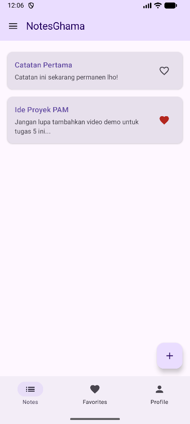
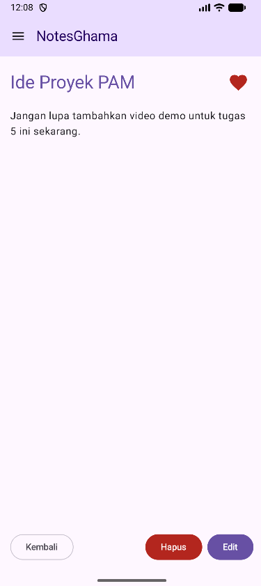
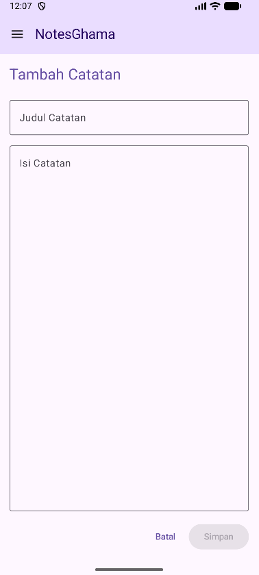
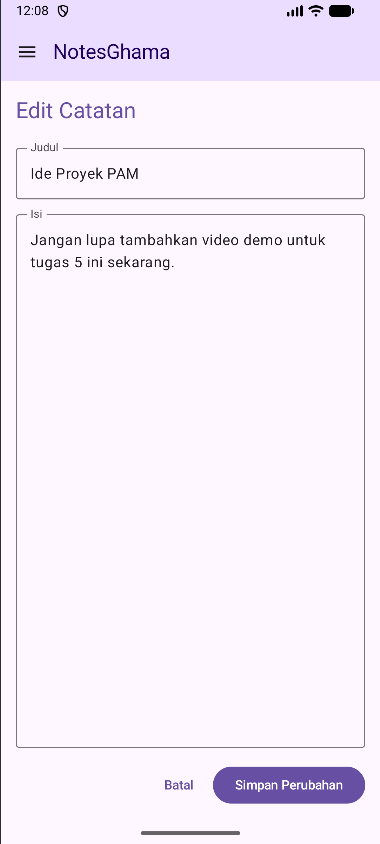
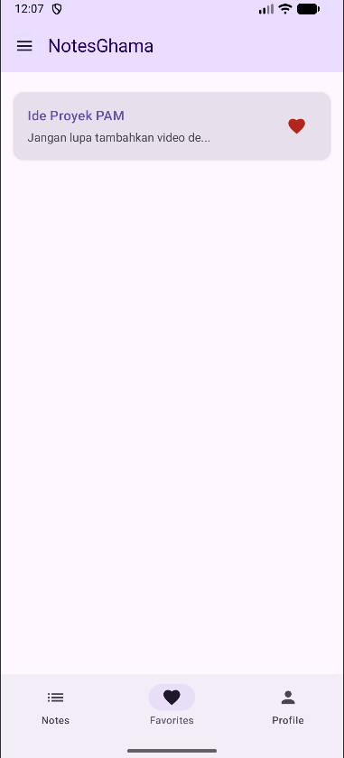
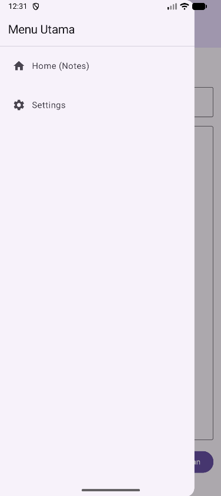
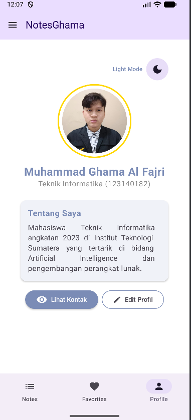
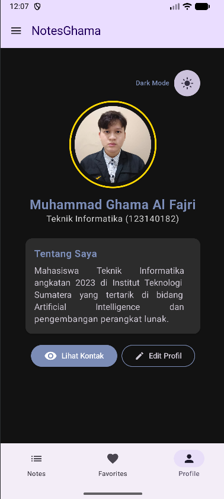

# NotesGhama - Tugas Praktikum PAM Minggu 5

- **Nama:** Muhammad Ghama Al Fajri
- **NIM:** 123140182
- **Mata Kuliah:** Pengembangan Aplikasi Mobile (PAM) - ITERA

Aplikasi **NotesGhama** adalah aplikasi manajemen catatan yang dibangun menggunakan **Compose Multiplatform**. Proyek ini merupakan implementasi dari Tugas Praktikum Minggu 5 yang berfokus pada arsitektur navigasi multi-layar yang kompleks, termasuk pengiriman argumen antar layar, penggunaan *Bottom Navigation*, dan *Navigation Drawer*.

---

## ✨ Fitur & Pemenuhan Kriteria Tugas

Aplikasi ini telah memenuhi seluruh spesifikasi tugas (termasuk Bonus):
- [x] **Bottom Navigation:** Terdapat 3 tab fungsional yaitu **Notes**, **Favorites**, dan **Profile**.
- [x] **Navigation with Arguments:** Mengirimkan `noteId` dari layar List/Favorites menuju layar **Note Detail** dan **Edit Note**.
- [x] **Floating Action Button (FAB):** Terdapat FAB khusus di tab Notes untuk melakukan navigasi ke layar **Add Note**.
- [x] **Proper Back Navigation:** Penanganan `popBackStack` yang benar saat menyimpan, mengedit, menghapus catatan, atau kembali dari layar detail.
- [x] **BONUS (Navigation Drawer):** Terdapat menu samping (*Hamburger Menu*) yang memungkinkan navigasi cepat ke *Home* dan *Settings*.
- [x] **Local Persistence:** Data catatan dan status favorit disimpan secara permanen di perangkat menggunakan *Multiplatform Settings*.

---

## 📁 Struktur Folder

Proyek ini menggunakan struktur *Clean Navigation* yang memisahkan komponen dengan rapi:
```text
com.example.notesghama/
├── navigation/
│   ├── AppNavigation.kt    # Setup NavHost, Drawer, dan BottomBar
│   └── Routes.kt           # Definisi Rute (Screen & BottomNavItem)
├── screens/
│   ├── NoteScreens.kt      # List, Detail, Add, dan Edit Screen
│   ├── OtherScreens.kt     # Favorites dan Settings Screen
│   └── ProfileScreen.kt    # UI Profil (Tugas 4) beserta ViewModel-nya
├── components/
│   ├── BottomNavBar.kt     # Komponen NavigationBar
│   └── NavDrawerContent.kt # Komponen isi ModalDrawerSheet
├── viewmodel/
│   └── NotesViewModel.kt   # State holder & Logika penyimpana catatan
└── App.kt                  # Entry point aplikasi
````

-----

## 🗺️ Navigation Flow Diagram

Berikut adalah alur navigasi dari aplikasi NotesGhama:

```text
=========================================================
            ALUR NAVIGASI APLIKASI NOTESGHAMA
=========================================================

[ Main Scaffold ]
   │
   ├──> [ Navigation Drawer ] (Bonus)
   │      ├── Menu: Home -------> (Pindah ke Tab Notes)
   │      └── Menu: Settings ---> [ Settings Screen ]
   │
   └──> [ Bottom Navigation ]
          │
          ├── Tab 1: Notes -----> [ Notes Screen ]
          │                         ├── Klik FAB (+) ---> [ Add Note Screen ]
          │                         │                       └── Simpan/Batal ---> *popBackStack*
          │                         │
          │                         └── Klik Catatan ---> [ Note Detail Screen ]
          │                                                 ├── Klik Edit ------> [ Edit Note Screen ]
          │                                                 │                       └── Simpan/Batal ---> *popBackStack*
          │                                                 └── Hapus/Kembali --> *popBackStack*
          │
          ├── Tab 2: Favorites -> [ Favorites Screen ]
          │                         └── Klik Catatan ---> [ Note Detail Screen ] (Alur sama seperti di atas)
          │
          └── Tab 3: Profile ---> [ Profile Screen ]

=========================================================
```

-----

## 📸 Screenshots

| Tab Notes (Home) | Note Detail |
| :---: | :---: |
|  |  |

| Add Note | Edit Note |
| :---: | :---: |
|  |  |

| Tab Favorites | Navigation Drawer |
| :---: | :---: |
|  |  |

| Tab Profile | Tab Profile (Dark Mode) | 
| :---: | :---: |
|  |  |

-----

## 🎥 Video Demo (30 Detik)

Berikut adalah demonstrasi aplikasi yang menunjukkan fungsionalitas 3 tabs, state navigasi, pengiriman argumen, form pengeditan, serta drawer:

👉 **[Tonton Video Demo di Sini](https://drive.google.com/file/d/1kIjNPcQ77ih6iLlZrOiVICSwOj4UatHn/view?usp=sharing)**
