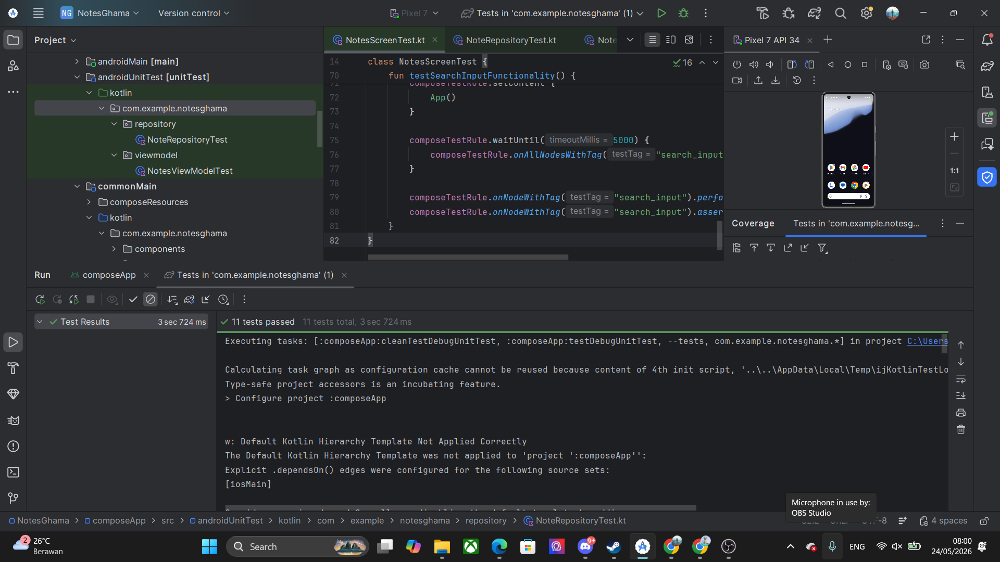
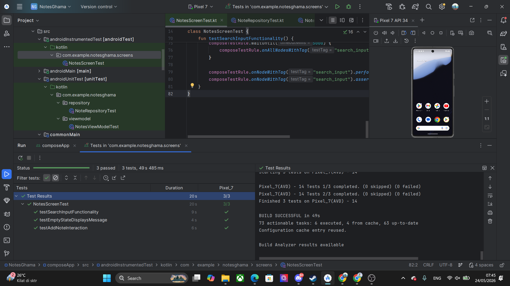

## TUGAS PRAKTIKUM MINGGU 10: Testing dan Dependency Injection
Nama   : Muhammad Ghama Al Fajri
NIM    : 123140182
PAM    : RA
Informasi lengkap kode ada di branch week-8 (week-10 fokus pada testing)

### Test Coverage Report

#### 1. Unit Test: NoteRepository (5 Test Cases)
Menguji operasi logika database dan remote data source secara terisolasi.
- `testInsertNote`: Memastikan fungsi insert memanggil query database dan remote source dengan benar.
- `testUpdateNote`: Memastikan fungsi update menyimpan data baru ke database dan memicu update remote.
- `testDeleteNote`: Memastikan fungsi delete menghapus data berdasarkan ID di database dan remote.
- `testToggleFavorite`: Memastikan status favorit pada catatan dapat diubah.
- `testGetNoteById`: Memastikan pengambilan data tunggal (Read) mengembalikan entitas yang tepat sesuai ID.

#### 2. Unit Test: NotesViewModel (MockK & Turbine - 5 Test Cases)
Menguji interaksi ViewModel dengan Repository serta aliran State (Flow).
- `testUiStateEmitsLoadingThenContent`: (Turbine) Memastikan UI State memancarkan status `Loading` terlebih dahulu, lalu berubah menjadi `Content` yang berisi daftar catatan.
- `testSearchQueryUpdatesProperly`: (Turbine) Memastikan Flow pencarian merespons perubahan input teks dengan benar.
- `testAddNoteCallsRepository`: (MockK) Memastikan pemanggilan fungsi tambah catatan di ViewModel meneruskan data ke Repository.
- `testDeleteNoteCallsRepository`: (MockK) Memastikan fungsi hapus di ViewModel memicu fungsi hapus di Repository dengan parameter yang sesuai.
- `testToggleFavoriteCallsRepository`: (MockK) Memastikan fungsi toggle favorit memicu perintah yang sama di Repository.

#### 3. UI Test: NotesScreen (Compose UI Test - 3 Test Cases)
Menguji interaksi pengguna dengan antarmuka secara otomatis melalui instrumen Android.
- `testEmptyStateDisplaysMessage`: Memastikan layar menampilkan pesan kosong ("Belum ada catatan...") ketika database tidak memiliki data.
- `testAddNoteInteraction`: Mensimulasikan klik tombol FAB tambah, mengisi input judul dan konten, lalu menekan tombol simpan.
- `testSearchInputFunctionality`: Mensimulasikan pengetikan pada kolom pencarian dan memastikan teks yang diketik muncul dengan benar di layar.

### Video Demo
[Tautkan URL Video Demo 45 Detik Anda Di Sini]