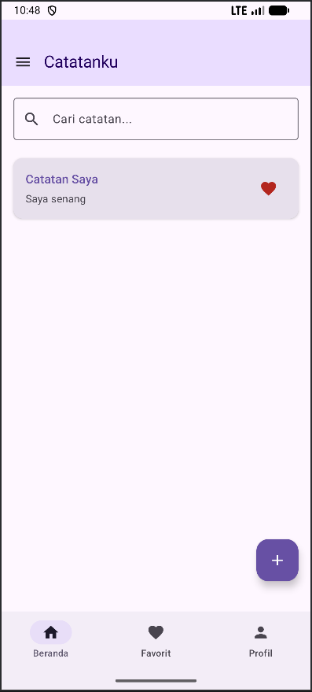
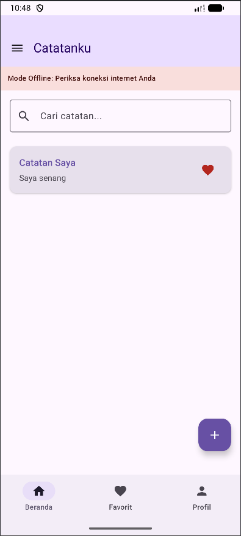
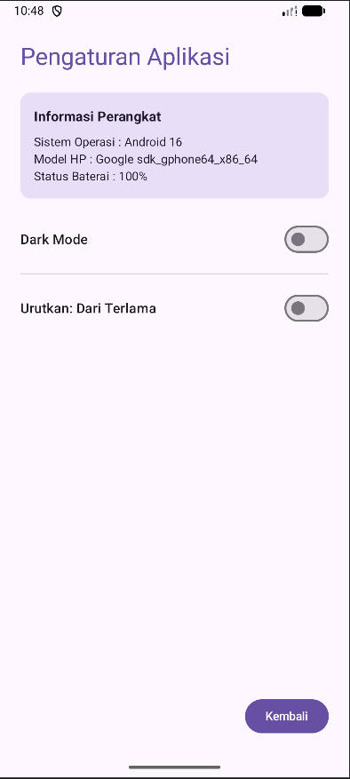
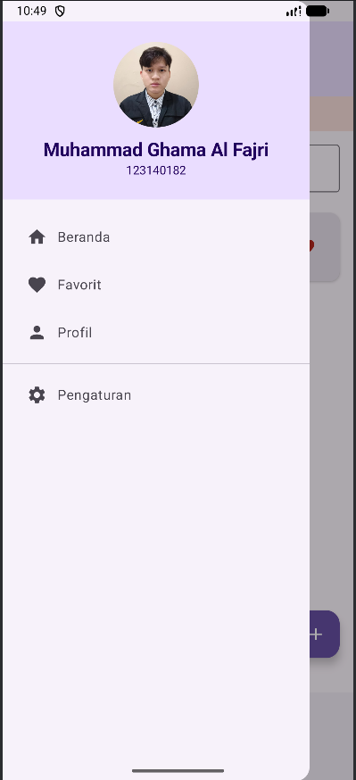

# NotesGhama - Platform Specific Features & Dependency Injection

Tugas Praktikum Minggu 8 untuk mata kuliah Pengembangan Aplikasi Mobile (PAM) - Teknik Informatika ITERA. Proyek ini fokus pada implementasi Dependency Injection menggunakan **Koin** dan akses fitur perangkat menggunakan pola **expect/actual**.

**Identitas Mahasiswa:**
- **Nama:** Muhammad Ghama Al Fajri
- **NIM:** 123140182

## 🚀 Fitur Terbaru (Week 8)
Pada pembaruan minggu ini, aplikasi telah ditingkatkan dengan:
- [x] **Koin DI Implementation**: Seluruh dependensi (Database, Repository, Settings, ViewModel) kini di-inject melalui Koin untuk kode yang lebih bersih dan teruji.
- [x] **Network Monitor (expect/actual)**: Indikator *real-time* di bagian atas layar yang mendeteksi jika koneksi internet terputus.
- [x] **Device Info (expect/actual)**: Menampilkan informasi OS dan model perangkat di layar Pengaturan.
- [x] **🌟 Bonus (+10%) Battery Info**: Menampilkan persentase baterai perangkat secara akurat di layar Pengaturan.

---

## 🏗️ Architecture Diagram (Koin DI Flow)

Aplikasi menggunakan **Koin** untuk mengelola *lifecycle* objek secara terpusat:

```text
       [ Android / iOS / JVM ]
                 │
       ┌─────────▼─────────┐
       │  platformModule   │ (DatabaseDriverFactory)
       └─────────┬─────────┘
                 │
       ┌─────────▼─────────┐
       │   sharedModule    │ (NotesDatabase, Repository, Settings)
       └─────────┬─────────┘
                 │
       ┌─────────▼─────────┐
       │   NotesViewModel  │ (Injected with Repo & NetworkMonitor)
       └─────────┬─────────┘
                 │
       ┌─────────▼─────────┐
       │      UI Layer     │ (NoteList, Settings, etc.)
       └───────────────────┘
```

---

## 🛠️ Teknologi & Library
- **Koin Multiplatform**: Dependency Injection.
- **SQLDelight**: Local Persistent Storage.
- **Multiplatform Settings**: DataStore/Preferences.
- **ConnectivityManager (Android)**: Real-time network detection.
- **BatteryManager (Android)**: Battery status access.
- **Material 3**: UI Components & Navigation.

---

## 📸 Screenshots

| Home (Online) | Network Offline Indicator |
| :---: | :---: |
|  |  |

| Device & Battery Info | Nav Drawer (Tombol Settings) |
| :---: | :---: |
|  |  |

---

## 🎥 Video Demo

👉 **[Tonton Video Demo Tugas Minggu 8 di Sini](https://drive.google.com/file/d/1IWd_98b9XGauJIFsooX8pa0vgXDE1gBe/view?usp=sharing)** 👈
