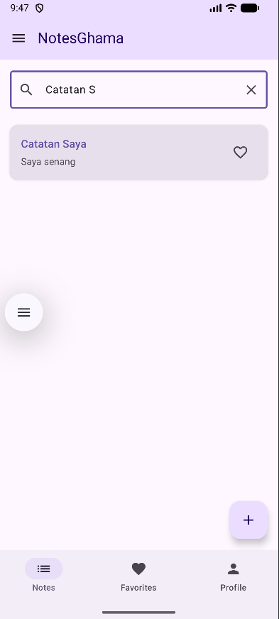
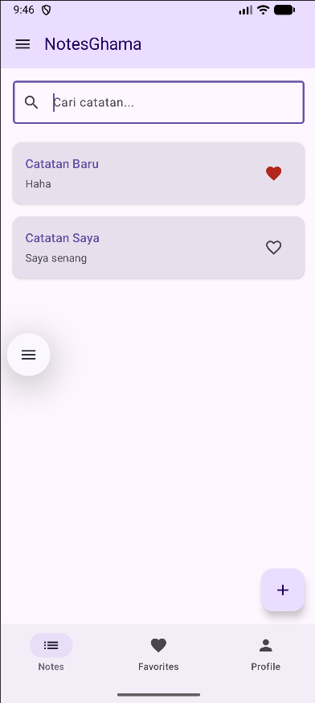

# NewsGhama - Tugas Praktikum PAM Minggu 6

- **Nama:** Muhammad Ghama Al Fajri
- **NIM:** 123140182
- **Mata Kuliah:** Pengembangan Aplikasi Mobile (PAM) - ITERA

Aplikasi **NewsGhama** adalah aplikasi pembaca berita (*News Reader*) yang dibangun menggunakan **Compose Multiplatform**. Proyek ini merupakan implementasi dari Tugas Praktikum Minggu 6 yang berfokus pada Networking (REST API), pengelolaan UI State, dan arsitektur *Repository Pattern*.

---

## ✨ Fitur & Pemenuhan Kriteria Tugas

Aplikasi ini telah memenuhi seluruh spesifikasi tugas (termasuk Bonus 10%):
- [x] **API Integration:** Mengambil data berita dunia nyata menggunakan **Ktor Client** (dari public API `Saurav.tech/NewsAPI`).
- [x] **Data Parsing:** Melakukan parsing JSON secara otomatis menggunakan `Kotlinx Serialization`.
- [x] **UI States:** Penanganan interaktif untuk state *Loading* (Spinner), *Success* (List Berita), dan *Error* (Pesan & Tombol Retry).
- [x] **Pull to Refresh:** Fitur usap ke bawah (*swipe down*) pada list untuk memuat ulang data berita terbaru menggunakan `PullToRefreshBox`.
- [x] **Detail Screen:** Navigasi ke layar detail saat artikel diklik, menampilkan gambar resolusi tinggi menggunakan **Kamel Image**, judul, dan konten.
- [x] **Architecture:** Menerapkan *Repository Pattern* untuk memisahkan logika pemanggilan API dari UI (*Clean Architecture*).
- [x] **BONUS (+10%): Offline Caching:** Data berita yang berhasil diambil akan disimpan ke *Local Storage* menggunakan `Multiplatform Settings`. Jika aplikasi dijalankan saat *Offline* (tanpa internet), aplikasi akan memuat dan menampilkan data terakhir dari *cache*.

---

## 📁 Struktur Folder

Proyek ini menggunakan struktur *Modular* yang memisahkan komponen berdasarkan fungsionalitasnya:
```text
com.example.notesghama/
├── model/
│   └── NewsModel.kt        # Data Class & Kotlinx Serializable
├── repository/
│   └── NewsRepository.kt   # Logika pemanggilan Ktor API & Offline Caching
├── viewmodel/
│   └── NewsViewModel.kt    # State holder (Loading, Success, Error)
├── screens/
│   └── NewsScreens.kt      # UI List Berita (Card) dan Detail Layar
└── App.kt                  # Entry point & Setup NavHost
````

-----

## 🗺️ Navigation & Data Flow Diagram

Berikut adalah alur navigasi dan aliran data (*Data Flow*) dari aplikasi NewsGhama:

```text
=========================================================
            ALUR NAVIGASI & DATA APLIKASI
=========================================================

[ App.kt (NavHost) ]
   │
   └──> [ NewsListScreen ] (Mendengarkan State dari ViewModel)
          │
          ├── State: LOADING ---> Tampilkan CircularProgressIndicator
          │
          ├── State: ERROR -----> Tampilkan Pesan Error & Tombol "Coba Lagi"
          │
          └── State: SUCCESS ---> Tampilkan LazyColumn (Daftar Berita)
                                    │
                                    ├── Pull-to-Refresh ---> Panggil API Ulang
                                    │
                                    └── Klik Artikel Card -> Navigasi ke [ NewsDetailScreen ]
                                                               │
                                                               └── Tekan Tombol Back ---> *popBackStack*

---------------------------------------------------------
[ Repository Pattern & Offline Cache Flow ]

Ktor Client ---> Fetch API
                   ├─ Berhasil -> Simpan ke Settings (Cache) -> Tampil di UI
                   └─ Gagal/Offline -> Ambil dari Settings (Cache) -> Tampil di UI
```

-----

## 📸 Screenshots

| Loading State | Success State (List Berita) |
| :---: | :---: |
|  |  |

| Detail Artikel | Pull to Refresh Indicator |
| :---: | :---: |
|  |

-----

## 🎥 Video Demo (30 Detik)

Berikut adalah demonstrasi aplikasi yang menunjukkan proses pemuatan data (Loading), keberhasilan memuat List Berita, Navigasi ke Detail, Error State (saat internet dimatikan), dan fitur *Pull to Refresh*:

👉 **[Tonton Video Demo di Sini](https://drive.google.com/file/d/1g_ql4FYtS-YSF5x25UkLiMK0Z2iuh5-W/view?usp=sharing)**