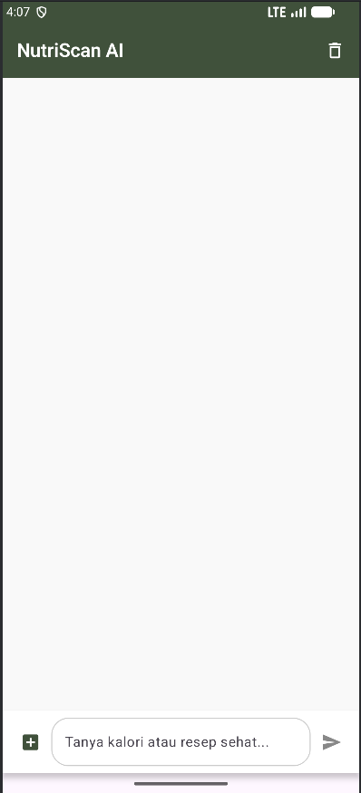

# NutriScan AI - Integrasi AI API

Tugas Praktikum Pertemuan 9 untuk mata kuliah Pengembangan Aplikasi Mobile (PAM) - Teknik Informatika ITERA. Proyek ini difokuskan pada integrasi Google Gemini API dengan mengimplementasikan arsitektur bersih, penanganan jaringan, dan rekayasa *prompt* (Prompt Engineering).

**Identitas Mahasiswa:**
- **Nama:** Muhammad Ghama Al Fajri
- **NIM:** 123140182

---

## Fitur Utama & Kriteria Penilaian
Pada pembaruan praktikum minggu ini, aplikasi telah dibangun dengan memenuhi seluruh kriteria dan poin bonus:
- [x] **Smart Chatbot & Food Analysis**: Integrasi AI Service Layer untuk menganalisis kalori makanan dan memberikan rekomendasi gizi menggunakan *system prompt* terstruktur.
- [x] **Multi-turn Conversation (Bonus +5%)**: Model memiliki memori riwayat obrolan untuk menjaga konteks interaksi yang berkelanjutan dengan pengguna.
- [x] **Image Analysis (Bonus +10%)**: Dukungan input multimodal yang memungkinkan AI membaca dan mengekstrak informasi gizi dari unggahan foto makanan.
- [x] **Streaming Response (Bonus +5%)**: Antarmuka merender teks secara gradual untuk meminimalisasi waktu tunggu persepsi pengguna.
- [x] **Proper Error Handling**: Implementasi Ktor Client dengan sistem *Exponential Backoff Retry* terisolasi untuk menangani *Rate Limit* (HTTP 429) dan masalah jaringan secara otomatis.
- [x] **Responsive UI/UX**: Desain antarmuka profesional (menggunakan palet khusus #40513B dan #628141) yang dilengkapi dengan *loading states* dan indikator pengetikan.

---

## Arsitektur Aplikasi (Integrasi API Flow)

Aplikasi menggunakan pola arsitektur berlapis untuk memisahkan antarmuka pengguna dari logika jaringan dan konfigurasi API:

```text
       [ Compose Multiplatform UI ]
                 │
       ┌─────────▼─────────┐
       │ NutritionViewModel│ (Manajemen state, Retry Logic, Streaming UI)
       └─────────┬─────────┘
                 │
       ┌─────────▼─────────┐
       │   AIRepository    │ (Penyimpanan memori obrolan & System Instruction)
       └─────────┬─────────┘
                 │
       ┌─────────▼─────────┐
       │   GeminiService   │ (Ktor HTTP Client & Kotlinx Serialization)
       └─────────┬─────────┘
                 │
       [ Google Gemini API ]

```

---

## Teknologi & Library

* **Google Gemini API (gemini-1.5-flash)**: Large Language Model Engine.
* **Ktor Client**: HTTP Networking untuk melakukan panggilan API lintas platform.
* **Kotlinx Serialization**: Parsing JSON untuk Data Transfer Object (DTO).
* **Compose Multiplatform**: Framework UI deklaratif.
* **Coroutines & Flow**: Manajemen status asinkron dan reaktivitas data.

---

## Tangkapan Layar

| Chat Analysis (Teks) | 
| --- | 
|  | 

---

## Keamanan Konfigurasi

Untuk menjalankan proyek ini di mesin lokal, *API Key* tidak disertakan dalam *Version Control System*. Anda harus menambahkan properti `GEMINI_API_KEY=kunci_anda` di dalam file `local.properties` pada direktori utama proyek untuk memungkinkan injeksi pada saat kompilasi.
