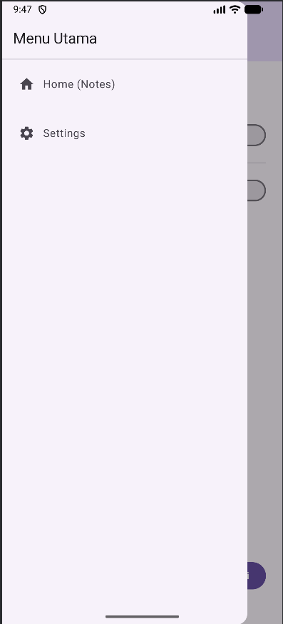
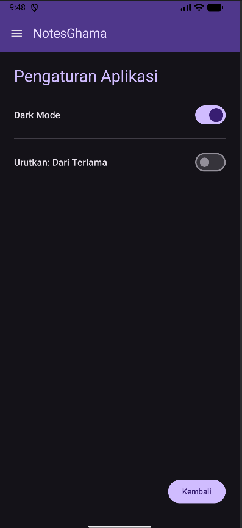
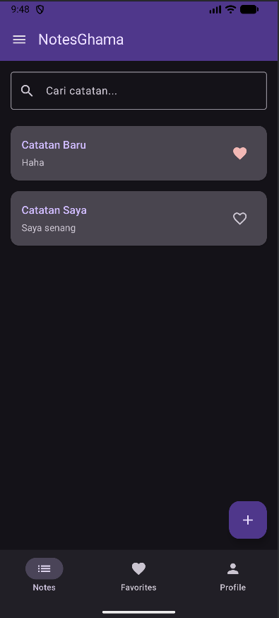
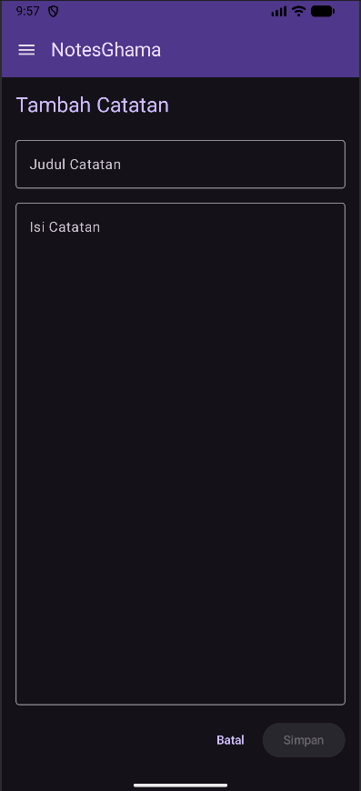
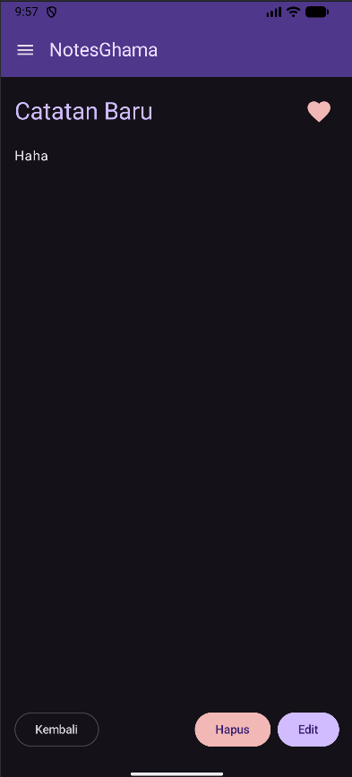

# NotesGhama - Local Data Storage & Offline-First Architecture

Repositori ini berisi implementasi Tugas Praktikum Minggu 7 untuk mata kuliah Pengembangan Aplikasi Mobile (PAM) di Institut Teknologi Sumatera (ITERA). Aplikasi ini adalah aplikasi pencatatan (Notes App) lintas platform (KMP & CMP) yang menerapkan arsitektur *Offline-First* menggunakan **SQLDelight** dan **DataStore**.

**Identitas Mahasiswa:**
- **Nama:** Muhammad Ghama Al Fajri
- **NIM:** 123140182

## 🚀 Fitur yang Diimplementasikan
Aplikasi ini telah memenuhi seluruh kriteria rubrik penilaian dan mengimplementasikan fitur bonus:

- [x] **SQLDelight Database**: Penyimpanan data lokal (*Offline-first*).
- [x] **CRUD Operations**: Fungsionalitas Create, Read, Update, dan Delete catatan berjalan 100%.
- [x] **Search Functionality**: Pencarian berdasarkan judul dan isi catatan secara *real-time*.
- [x] **DataStore Settings**: Menyimpan preferensi pengguna (*Dark Mode* dan Pengurutan *Ascending/Descending*).
- [x] **UI/UX & States**: Manajemen *state* UI yang proper (`Loading`, `Empty`, `Content`, `Error`).
- [x] **🌟 Bonus (+10%) - Remote Sync Simulation**: Sinkronisasi *background* menggunakan Ktor dan Coroutines Flow.

---

## 🗄️ Database Schema (SQLDelight)

Aplikasi ini menggunakan SQLDelight dengan skema tabel `NoteEntity` sebagai berikut:

```sql
CREATE TABLE NoteEntity (
    id INTEGER PRIMARY KEY AUTOINCREMENT,
    title TEXT NOT NULL,
    content TEXT NOT NULL,
    isFavorite INTEGER NOT NULL DEFAULT 0,
    created_at INTEGER NOT NULL,
    updated_at INTEGER NOT NULL
);
```

**Penjelasan Kolom:**
- `id`: *Primary Key* dengan *Auto-Increment*.
- `title` & `content`: Menyimpan judul dan isi catatan.
- `isFavorite`: Penanda (0 atau 1) untuk fitur catatan favorit.
- `created_at` & `updated_at`: Waktu pembuatan dan pembaruan (*epoch milliseconds*) untuk manajemen *sorting* dan *sync*.

---

## 🛠️ Teknologi yang Digunakan
- **Kotlin Multiplatform (KMP)** & **Compose Multiplatform (CMP)**
- **SQLDelight** (Local Database)
- **Multiplatform Settings** (DataStore Coroutines)
- **Ktor Client** (Simulasi Remote API)
- **Kotlinx Coroutines & Flow** (Asynchronous & Reactive Data)
- **Kotlinx Datetime** (Manajemen Waktu)

---

## 📸 Screenshots

| Halaman Awal (Sudah ditambahkan note) | Halaman Favorit |
| :---: | :---: |
|  |  |

| Halaman Profile | Search Notes |
| :---: | :---: |
|  |  |

| NavBar Drawer | Halaman Settings |
| :---: | :---: |
|  |  |

| Halaman Utama (Dark Mode) | Offline Mode |
| :---: | :---: |
|  |  |

| Tambahkan Note | Edit/Hapus Note |
| :---: | :---: |
|  |  |

---

## 🎥 Video Demo

👉 **[Tonton Video Demo Aplikasi di Sini](https://drive.google.com/file/d/1s6NuvxctYmzkf5c_qF0tyQsRuklP0pN2/view?usp=sharing)** 👈
